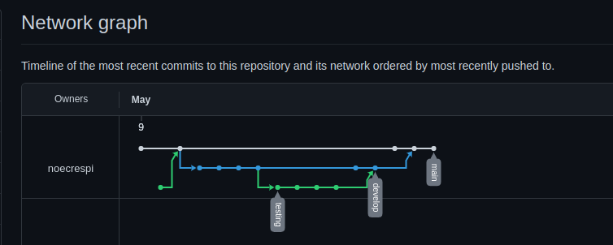
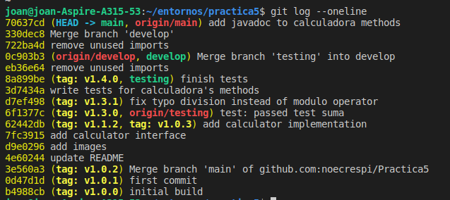
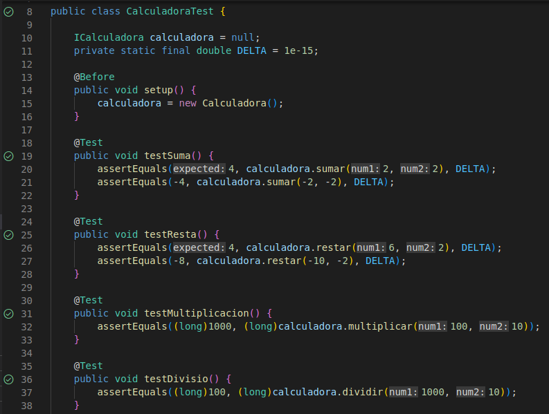
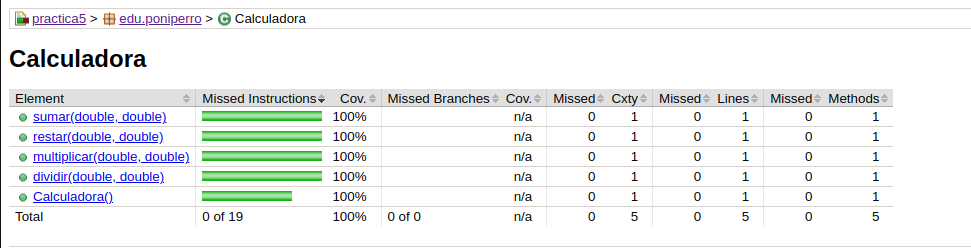

# Practica5 - JUnit

1. Crear proyecto en github (Practica5).
2. Crear una interfaz llamada `ICalculadora` dentro de la carpeta `main/java/edu/poniperro`, el cual contien las operaciones sumar, restar, multiplicar y dividir.
3. Crear una clase `Calculadora` que utilice la interfaz `ICalculadora` e implementar los métodos.
4. Realizar commits a github.
5. Crear los test unitarios en JUnit de los cuatro métodos.
7. Realizar diferentes pruebas para validar que los test funcionan y exponer los resultados
los resultados obtenidos, % de tests pasados etc.

##### Diagrama de las ramas

##### Versionado semantico

##### JavaDoc

##### Casos tests

##### Coverage Jacoco

##### Hecho por Joan Nicolau y Noelia Crespí
